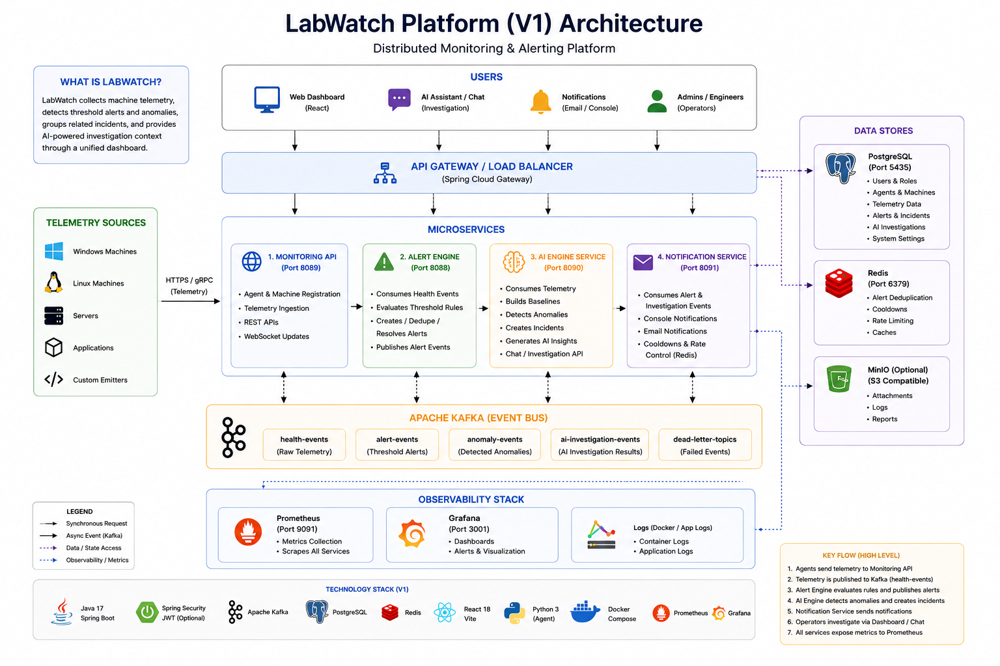

# LabWatch Platform

## System Architecture



LabWatch is a distributed monitoring platform that simulates a real infrastructure alerting workflow. It collects machine telemetry, publishes health events through Kafka, detects threshold alerts and statistical anomalies, groups related incidents, and surfaces operational context through a React dashboard.

The project is structured as a recruiter/demo-friendly microservice system: easy to run locally with Docker Compose, but with production-shaped concerns such as Flyway migrations, optional JWT auth, agent tokens, Kafka retry/dead-letter topics, Redis-backed cooldowns, Prometheus metrics, and notification channels.

## Why LabWatch?

I built LabWatch to better understand how modern backend systems monitor infrastructure, process telemetry, and automate incident response. Rather than focusing on CRUD functionality, the project explores event-driven microservices, observability, anomaly detection, and production-inspired system design.

## What It Does

- Ingests host telemetry from a Python agent or direct REST calls
- Registers agents and machines before telemetry ingestion
- Publishes health events to Kafka for asynchronous processing
- Creates, deduplicates, and resolves alerts from threshold rules
- Builds rolling behavior baselines and detects z-score anomalies
- Promotes anomalies into alert/incident workflows with cooldown control
- Generates AI investigation context using mock, OpenAI, or Bedrock providers
- Dispatches console/email notifications for alert and investigation events
- Displays machines, telemetry, alerts, incidents, anomalies, and chat-assisted investigation flows in a React dashboard
- Exposes Prometheus metrics for backend services

## Architecture

```text
Python agent or demo seed script
        |
        v
monitoring-api
  - agent registration
  - telemetry ingestion
  - machine/account ownership
  - WebSocket updates
        |
        v
Kafka: health-events
        |
        +--------------------+
        |                    |
        v                    v
alert-engine          ai-engine-service
  - threshold rules     - rolling baselines
  - alert lifecycle     - anomaly detection
  - alert-events        - AI investigation context
        |                    |
        +---------+----------+
                  v
          notification-service
          - console/email delivery
          - Redis cooldowns

PostgreSQL stores machines, agents, telemetry, alerts, anomalies, and investigations.
Redis supports cooldown state. Prometheus and Grafana provide local observability.
```

## Services

| Component | Purpose | Default URL |
| --- | --- | --- |
| `monitoring-api` | REST API for auth, agents, machines, telemetry, and WebSocket updates | http://localhost:8089 |
| `alert-engine` | Kafka consumer that creates/resolves threshold alerts | http://localhost:8088 |
| `ai-engine-service` | Anomaly detection, incident correlation, AI insights, and chat APIs | http://localhost:8090 |
| `notification-service` | Consumes alert/investigation events and dispatches notifications | http://localhost:8091 |
| `labwatch-dashboard` | React/Vite frontend for the operator experience | http://localhost:5173 |
| `labwatch-agent` | Python telemetry collector for a local host | n/a |
| PostgreSQL | Shared local persistence | localhost:5435 |
| Kafka | Event backbone | localhost:9092 |
| Redis | Cooldown/state store | localhost:6379 |
| Prometheus | Metrics scraping | http://localhost:9091 |
| Grafana | Metrics dashboards | http://localhost:3001 |

## Tech Stack

- Java 17, Spring Boot, Spring Security, Spring Data JPA, Spring WebSocket
- Apache Kafka and Spring Kafka
- PostgreSQL with Flyway migrations
- Redis for cooldown and coordination state
- React, Vite, React Router, Recharts, Axios, STOMP/SockJS
- Python host agent using `psutil`
- Docker Compose, Prometheus, Grafana
- Maven, npm, pytest-compatible Python project layout

## Repository Layout

```text
.
|-- monitoring-api/          # telemetry ingestion, auth, agents, machines, websocket
|-- alert-engine/            # threshold alert processing and alert lifecycle
|-- ai-engine-service/       # anomaly detection, incidents, AI investigation APIs
|-- notification-service/    # alert/investigation notification consumer
|-- labwatch-dashboard/      # React operator dashboard
|-- labwatch-agent/          # Python host telemetry agent
|-- docs/                    # deployment, profiles, and stability notes
|-- scripts/                 # demo telemetry helpers
|-- docker-compose.yml       # local platform stack
|-- prometheus.yml           # local metrics scrape config
|-- .env.example             # local Compose defaults
`-- .env.production.example  # production-oriented environment template
```

## Prerequisites

- Docker Desktop
- Java 17, if running services outside Docker
- Node.js and npm, if running the dashboard locally
- Python 3, if running the local host agent

## Quick Start

Start the backend platform:

```bash
cp .env.example .env
docker compose up --build -d
```

Check health:

```bash
curl http://localhost:8089/actuator/health
curl http://localhost:8088/actuator/health
curl http://localhost:8090/actuator/health
curl http://localhost:8091/actuator/health
```

Seed demo telemetry:

```bash
./scripts/seed-demo-telemetry.sh
```

Start the dashboard:

```bash
cd labwatch-dashboard
npm install
npm run dev
```

Open http://localhost:5173.

## Running the Agent

The Python agent collects local CPU, memory, disk, uptime, host, and process metrics, then posts telemetry snapshots to `monitoring-api`.

```bash
cd labwatch-agent
python3 -m venv .venv
source .venv/bin/activate
pip install -r requirements.txt
cp .env.example .env
python -m agent --once
```

Run continuously:

```bash
python -m agent
```

More details are in [labwatch-agent/README.md](labwatch-agent/README.md).

## Dashboard Configuration

The dashboard defaults to the local backend URLs:

```env
VITE_MONITORING_API_URL=http://localhost:8089
VITE_ALERT_ENGINE_URL=http://localhost:8088
VITE_AI_ENGINE_URL=http://localhost:8090
VITE_NOTIFICATION_SERVICE_URL=http://localhost:8091
```

To override them:

```bash
cd labwatch-dashboard
cp .env.example .env.local
```

More details are in [labwatch-dashboard/README.md](labwatch-dashboard/README.md).

## API Examples

Register an agent:

```bash
curl -sS -X POST http://localhost:8089/api/v1/agents/register \
  -H "Content-Type: application/json" \
  -d '{
    "machineIdentifier": "lab-pc-01",
    "hostname": "lab-pc-01.local",
    "osType": "Darwin",
    "osVersion": "23.5.0",
    "agentVersion": "1.0.0"
  }'
```

Send a telemetry snapshot:

```bash
curl -sS -X POST http://localhost:8089/api/v1/telemetry/snapshots \
  -H "Content-Type: application/json" \
  -d '{
    "machineIdentifier": "lab-pc-01",
    "hostname": "lab-pc-01.local",
    "osType": "Darwin",
    "osVersion": "23.5.0",
    "uptimeSeconds": 86400,
    "timestamp": "2026-07-03T12:00:00Z",
    "cpuUsage": 94.0,
    "memoryUsage": 82.0,
    "diskUsage": 41.0,
    "source": "manual-demo",
    "processMetrics": [
      {
        "processName": "java",
        "cpuPercent": 56.0,
        "memoryPercent": 22.0
      }
    ]
  }'
```

Common endpoints:

| Endpoint | Description |
| --- | --- |
| `POST /api/v1/auth/register` | Create a user account |
| `POST /api/v1/auth/login` | Login and receive a JWT |
| `POST /api/v1/agents/register` | Register a telemetry agent |
| `POST /api/v1/telemetry/snapshots` | Ingest telemetry |
| `GET /api/v1/machines` | List machines |
| `POST /api/v1/machines/{machineIdentifier}/claim` | Claim an unowned machine |
| `GET /api/alerts` | List alerts |
| `GET /api/anomalies` | List anomalies |
| `POST /api/chat` | Ask the AI investigation assistant |

When `LABWATCH_AGENT_AUTH_ENABLED=true`, telemetry requests should include `X-Agent-Token`. When `LABWATCH_AUTH_ENABLED=true`, protected user workflows require `Authorization: Bearer <jwt>`.

## Runtime Profiles

`docker compose` defaults to:

```env
LABWATCH_SPRING_PROFILE=demo
```

Profile summary:

| Profile | Use case |
| --- | --- |
| `local` | Developer-friendly defaults and local diagnostics |
| `demo` | Auth-off demo mode with mock AI provider |
| `staging` | Migration-driven startup, auth-on posture |
| `prod` | Production-oriented safety defaults |

Examples:

```bash
LABWATCH_SPRING_PROFILE=local docker compose up --build
LABWATCH_SPRING_PROFILE=staging LABWATCH_AUTH_ENABLED=true docker compose up --build
```

See [docs/ENVIRONMENT_PROFILES.md](docs/ENVIRONMENT_PROFILES.md) for the full profile guide.

## Auth and AI Modes

Local demo defaults:

```env
LABWATCH_AUTH_ENABLED=false
LABWATCH_AGENT_AUTH_ENABLED=false
AI_PROVIDER=mock
```

Auth-enabled local run:

```bash
LABWATCH_AUTH_ENABLED=true \
LABWATCH_AGENT_AUTH_ENABLED=true \
JWT_SECRET=replace-with-a-long-random-secret \
docker compose up --build
```

OpenAI-backed investigations:

```bash
AI_PROVIDER=openai \
OPENAI_API_KEY=your-api-key \
OPENAI_MODEL=gpt-4.1-mini \
docker compose up --build
```

For deployment-oriented environment values, start from [.env.production.example](.env.production.example).

## Testing

Run backend tests from each Spring service:

```bash
cd monitoring-api && ./mvnw test
cd ../alert-engine && ./mvnw test
cd ../ai-engine-service && mvn test
cd ../notification-service && mvn test
```

Run dashboard checks:

```bash
cd labwatch-dashboard
npm install
npm run lint
npm run build
```

## Observability

Backend services expose:

```text
/actuator/health
/actuator/prometheus
```

Prometheus is configured in [prometheus.yml](prometheus.yml) and is available at http://localhost:9091 when the Compose stack is running. Grafana is available at http://localhost:3001.

## Useful Commands

```bash
# Start everything in the background
docker compose up --build -d

# Follow logs for one service
docker compose logs -f monitoring-api

# Stop services but keep volumes
docker compose down

# Stop services and remove local persisted data
docker compose down -v

# Re-seed demo telemetry
./scripts/seed-demo-telemetry.sh
```

## Additional Docs

- [docs/ENVIRONMENT_PROFILES.md](docs/ENVIRONMENT_PROFILES.md)
- [docs/DEPLOYMENT_READINESS.md](docs/DEPLOYMENT_READINESS.md)
- [docs/STABILITY_TESTING.md](docs/STABILITY_TESTING.md)
- [labwatch-agent/README.md](labwatch-agent/README.md)
- [labwatch-dashboard/README.md](labwatch-dashboard/README.md)
